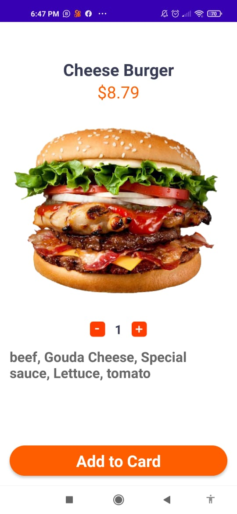
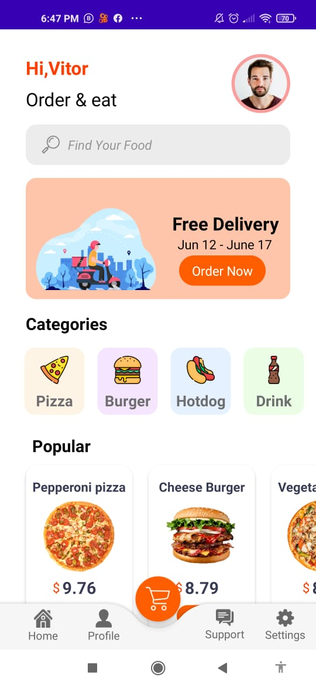
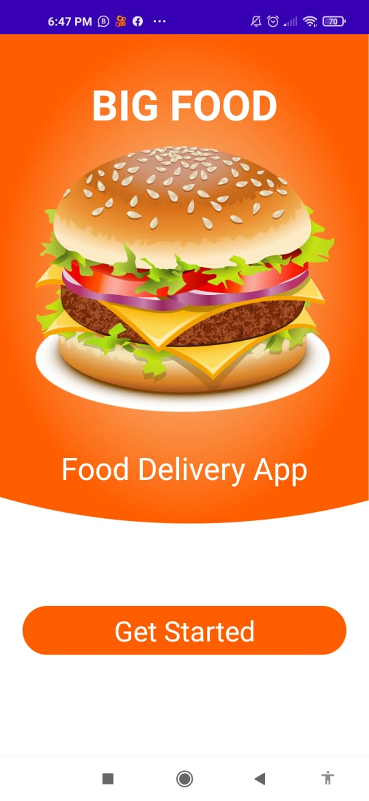
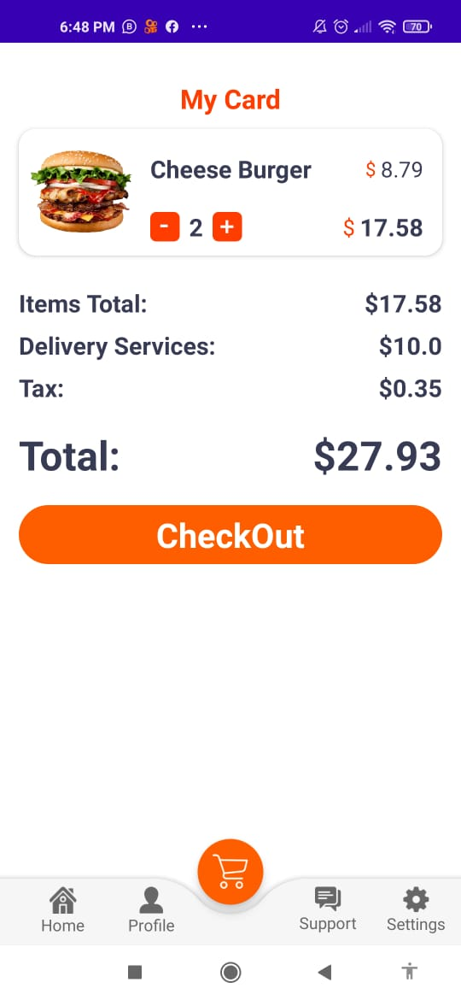

## :pizza: IfoodClone-it-may-let-you-hungry :yum:
Coding a quite interesting delivery app which one  you can set your orders 

<b> Libraries used in this project</b> 

* Glide
* Koin
* Material
* Gson
* Coroutines
* ViewModel
* Scalable Size unit

_________________________________________________________

The Main idea here, is observe and react to user's action, displaying the result on live time 
since the app isn't going to grow i used sharedPreferences to build some kind of  Tiny DataBase, 
it was able to track user's order details once he closes the app or navigate between activities

   
   
